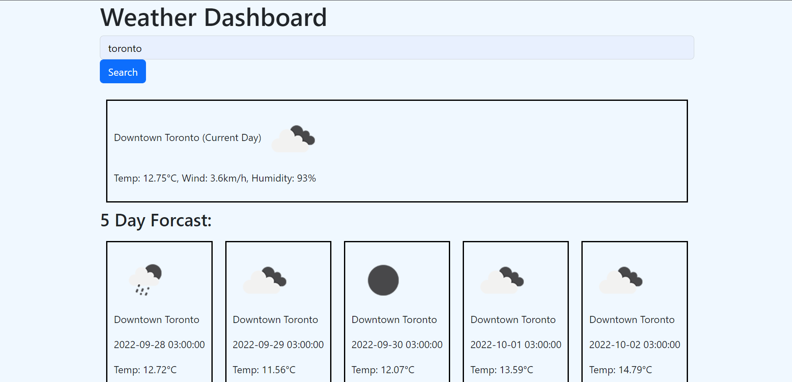
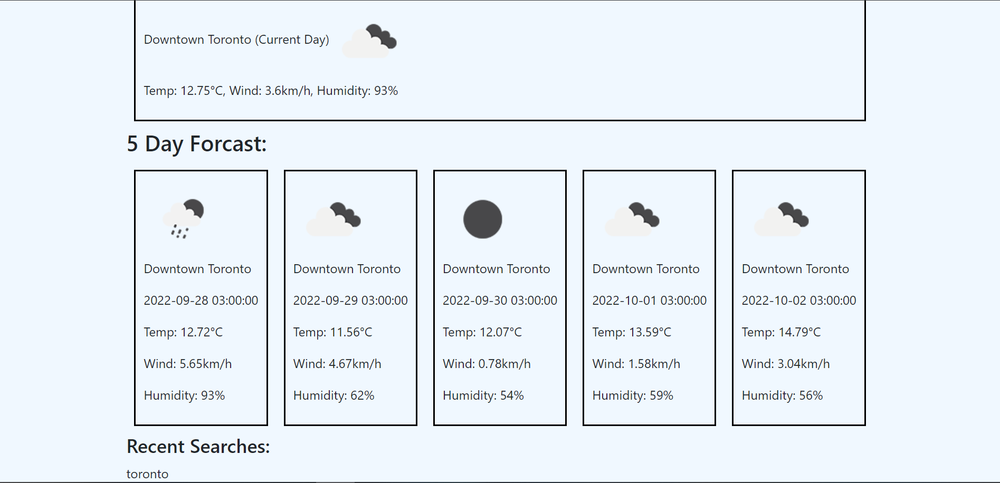

# Module6Challenge

## Description 

This project was built to be capable of checking the weather in any city. The motivation of this project was to implement the javascript and third-party web API skills learned during module 6. How to connect APIs to a working page with parameters and how to display the info with a working webpage was learned.

## Usage

To use this project:

- enter a city name and click 'search'
- city search history will be displayed locally and shown on screen

